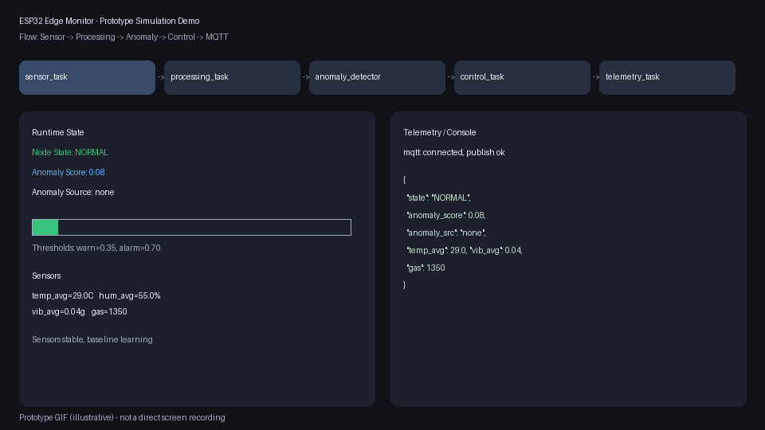

# ESP32 Edge Anomaly Telemetry Node
monitors industrial signals on `ESP32`, detects anomalies on-device, and publishes resilient MQTT telemetry.

## What It Does
- Samples `DHT22`, gas analog input, and `MPU6050` vibration.
- Runs `FreeRTOS` task pipeline with queue-based handoff.
- Applies threshold-based alarm logic with latched safety behavior.
- Computes lightweight anomaly score (`0.0-1.0`) and anomaly source.
- Publishes JSON telemetry over MQTT with offline queue + retry.
- Persists runtime thresholds to ESP32 `NVS`.
- Exposes operator controls via UART console.

## Architecture
```text
sensor_task -> processing_task -> control_task -> shared runtime
                     |                              |
                     |                              +-> telemetry_task (MQTT)
                     +-> anomaly detector           +-> console_task (UART)

supervisor_task monitors heartbeats of all tasks and forces FAULT on stalls.
```

## Prototype Demo GIF

This is an illustrative prototype animation showing expected task flow, anomaly scoring, state transitions, and MQTT behavior.

## Key Modules
- `src/main.cpp`: task wiring, runtime orchestration, supervisor.
- `src/alarm_logic.cpp`: threshold and latched alarm state machine.
- `src/anomaly_detector.cpp`: adaptive baseline + variance anomaly scoring.
- `src/mqtt_telemetry.cpp`: WiFi/MQTT client with retry and offline buffering.
- `src/config_persistence_esp32.cpp`: threshold save/load with NVS.
- `test/test_core.cpp`: host-runnable tests for core logic.

## Quick Start
1. Install PlatformIO:

```bash
brew install platformio
```

2. Build firmware:

```bash
pio run -e esp32dev
```

3. Run Wokwi simulation (uses `diagram.json` and `wokwi.toml`), then open serial monitor at `115200`.

## UART Commands
```text
help
status
thresholds
reset_alarm
set temp_warn 36
set temp_alarm 44
set hum_warn 72
set hum_alarm 85
set vib_warn 0.18
set vib_alarm 0.35
set gas_warn 1900
set gas_alarm 2900
set safe_ms 10000
```

## MQTT Telemetry
- Broker: `broker.hivemq.com:1883`
- Topic: `karimFin/esp32-edge-monitor-firmware/telemetry`
- Includes: sensor averages, state, fault info, `anomaly_score`, `anomaly_src`
- Reliability: bounded offline queue + reconnect flush
- Optional security flags in `platformio.ini`: `MQTT_USE_TLS`, `MQTT_USERNAME`, `MQTT_PASSWORD`

## Demo Narrative
1. Start in `NORMAL` with stable sensor values.
2. Increase gas/vibration to trigger `WARNING` and `ALARM`.
3. Observe anomaly score rising before or during threshold transitions.
4. Use UART `set` commands to tune thresholds live.
5. Disconnect/reconnect network and confirm queued telemetry flushes.
6. Reboot and verify threshold settings reload from NVS.

## Host Tests
```bash
mkdir -p build
clang++ -std=c++17 -Iinclude test/test_core.cpp src/alarm_logic.cpp src/anomaly_detector.cpp src/console_parser.cpp src/mpu6050_driver.cpp src/telemetry_utils.cpp -o build/test_core
./build/test_core
```

## CI
- GitHub Actions runs on push/PR:
- host unit tests
- `pio run -e esp32dev`
